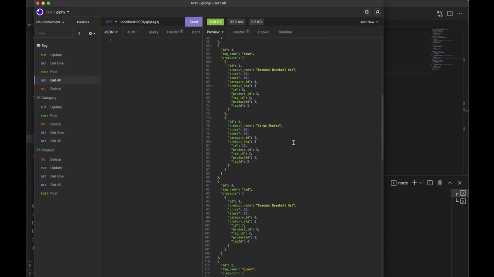

# the most bussin e-commerce back end
  
  [](https://opensource.org/licenses/MIT)

  ## Description

  Internet retail, also known as e-commerce, is the largest sector of the electronics industry, generating an estimated $29 trillion in 2019. I was tasked with developing a way for the industry to be expanded to $29,000,000,000,001. This database program launches from the command-line and keeps track of data in a variety of tables including cAtEgOrIeS, tAgS, and PrOdUcTs.

  [](https://drive.google.com/file/d/1bEam8YHhzLVIGMjZY2kHcrkLlb8O-n58/view?usp=sharing)

  ### Table of Contents

  * [Installation](#installation)
  * [Usage](#usage)
  * [Contribution Guidelines](#contribution-guidelines)
  * [Questions](#questions)
  

  ## Installation

  Download this repo, install dependencies with 
  ```
  npm i
  ```
  create database using the provided schema, seed database using 
  ```
  npm run seed
  ```
  finally launch the server with 
  ```
  npm run start
  ```

  ## Usage

  Using an api-testing tool, or plain ol' browser, fill out the routes, and have fun interacting with the database!


  ## Contribution Guidelines

  Submit bug or feature requests


  ## Questions

  If you have any questions, you may contact me at: 

  * Github: https://github.com/anguswaffle
  * Email: aidan.bachtell@gmail.com

  ---

  ## License 

  Licensed under [MIT License](https://opensource.org/licenses/MIT). 
